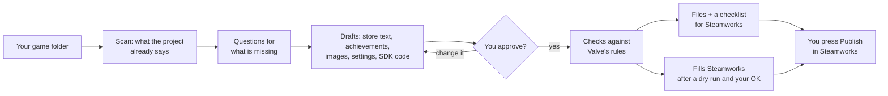
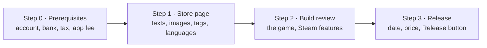

# steamworks-mcp

[](https://mcpservers.org/servers/wazzapsenk/steamworks-mcp)

**Put your game on Steam with your AI assistant.** It reads your game project, asks you what it cannot find, writes
your store page with you, checks everything against Valve's rules, and fills in Steamworks only after you say yes.
It never publishes anything: you press Publish.

Works with **Claude** (Desktop, Code and claude.ai), **ChatGPT** (web and desktop app) and **Codex** (app, CLI and
IDE extension). Free and open source ([MIT](LICENSE)).

**37 tools · 36 skills · 24 code rules · 124 release checks · 114 store-text rules · Unity, Godot and Unreal**

<!-- mcp-name: io.github.wazzapsenk/steamworks-mcp -->

> Not affiliated with or endorsed by Valve. "Steam" and "Steamworks" are trademarks of Valve Corporation.

**Contents:** [How it works](#how-it-works) · [Install](#install) · [Your first conversation](#your-first-conversation) ·
[Words you will see](#words-you-will-see) · [What it can do](#what-it-can-do) · [Skills](#skills) ·
[Code rules](#code-rules) · [Safety](#safety-what-it-never-does) · [Known limits](#known-limits) ·
[Advanced setup](docs/ADVANCED.md)

## How it works



Your game goes through four **release steps**, the same ones Valve reviews. The tool shows how far each one is:



Everything about your game's Steam release lives in one readable file in your game folder, `steamworks.yaml`. Every
value in it has a status: **missing**, **draft** (found or written, not yet checked by you), **approved** (you said
it is right), or **done in Steamworks**.

## Install

You need [uv](https://docs.astral.sh/uv/getting-started/installation/), a small tool that runs Python programs (one
command to install), and Claude, ChatGPT or Codex. You do **not** need Steam keys or a Steam login to start.

The server speaks both MCP transports:

| Transport | For | Started by |
|---|---|---|
| **stdio** (the default) | Apps that start the server on your computer: Claude Desktop, Claude Code, Codex (app, CLI, IDE extension), Cursor | the app itself (`steamworks-mcp`); `setup` and the plugin configure it |
| **Streamable HTTP** | Apps that connect over the internet: ChatGPT (web and desktop app), claude.ai | `steamworks-mcp remote` (with a secure address), or `steamworks-mcp --http` (local only, [details](docs/ADVANCED.md#remote-clients-chatgpt-claudeai)) |

Over HTTP every request needs sign-in (OAuth, or a bearer token); over stdio only the app that started the server
can talk to it.

### Claude Desktop

In a terminal:

```bash
uvx steamworks-mcp setup
```

It asks where your games are and connects Claude Desktop (and Claude Code, if you have it). Restart Claude Desktop.
To use the [skills](#skills) there too, add the folders in [`skills/`](skills/) as skills in Claude's settings.

### Claude Code: the plugin (server and skills in one step)

In Claude Code, type:

```
/plugin marketplace add https://github.com/wazzapsenk/steamworks-mcp
/plugin install steamworks@steamworks-mcp
```

It asks for your games folder. That's it.

### ChatGPT (web or desktop app) and claude.ai

These apps reach the server over the internet, through a secure address on your computer.

1. Install [cloudflared](https://developers.cloudflare.com/cloudflare-one/connections/connect-networks/downloads/)
   once (free, from Cloudflare). On Windows: `winget install --id Cloudflare.cloudflared`; on a Mac:
   `brew install cloudflared`.
2. In a terminal:

   ```bash
   uvx steamworks-mcp remote
   ```

   The first time, it asks where your games are. Then it prints an address that ends in `/mcp` and an access code.
3. Add the address in your app, with **OAuth** as the authentication:
   - **ChatGPT on the web**: Settings > Apps & Connectors > Advanced settings: turn on Developer mode, then create a
     connector.
   - **ChatGPT desktop app** (Windows, macOS): Settings > Plugins > MCPs > Add.
   - **claude.ai**: Settings > Connectors > Add custom connector.
4. A steamworks-mcp page opens and asks for the access code: type the one from step 2.
5. Ask your assistant: "Where are my games on Steam?"

Keep the terminal from step 2 open while you work. Custom connectors in ChatGPT need developer mode; check that your
plan has it. The address changes every time you start `remote` (update the connector's URL then);
[a fixed address](docs/ADVANCED.md#remote-clients-chatgpt-claudeai) needs a little more setup.

### Codex (app, CLI and IDE extension)

1. In a terminal (the same command as for Claude Desktop):

   ```bash
   uvx steamworks-mcp setup
   ```

2. Type the folder that holds your games (Enter keeps the one shown). The keys it offers are optional: Enter skips
   them.
3. When it asks `Codex?`, answer `y`. If it says "not found", Codex has not run on this computer yet; `y` still works.
4. Restart Codex (the app, or a new CLI session) and ask: "Where are my games on Steam?"

The server goes into `~/.codex/config.toml`, which the Codex app, the CLI and the IDE extension all read, so one setup
covers all three. Codex starts the server on your computer: no tunnel and no access code. Tools that only read run
without asking; Codex asks before every tool that changes something.

### Check the installation

```bash
uvx steamworks-mcp doctor
```

Other apps (Cursor and anything else that supports MCP) and connecting by hand: [docs/ADVANCED.md](docs/ADVANCED.md).

## Your first conversation

Just talk to your assistant. Some things you can say:

| You want to… | Say |
|---|---|
| Start | "Where are my games on Steam?" · "Help me get my game in `MyGame/` onto Steam." |
| See what's left | "What's still missing before my store page can go live?" |
| Store page | "Write my store page." · "Make my short description better." |
| Know the market | "What do the closest popular games do on their store pages?" · "Compare my game with games like it." |
| Price | "What should my game cost, and in each country?" |
| Achievements | "Design achievements for my game." · "Add the Steam code for them." |
| Check the code | "Check my game's Steam integration." |
| Images | "Make all my store images from my key art and logo." |
| Translations | "Translate my store page into German, French and Japanese." |
| Fill Steamworks | "Show me what would change in Steamworks, then apply it." |
| After launch | "How is my launch going?" · "What are players complaining about?" |

Every answer starts with one plain sentence and, where it helps, a table. The assistant shows you each draft; only
you approve.

## Words you will see

| Word | Means |
|---|---|
| **MCP server** | A helper program your AI app talks to. This project is one. |
| **Tool** | One thing the server can do, like "check my code" or "make my images". Your assistant picks the tools. |
| **Skill** | A ready-made recipe for your assistant, like "write the store page" (several tools in the right order). |
| **Prompt** | The same as a skill, for apps that show prompts instead of skills. |
| **Code rule** | A check of your game's code against Steamworks requirements, with the fix. |
| **steamworks.yaml** | The file in your game folder with every Steam setting of your game. Readable and editable. |
| **Draft / approved / done** | A value found or written for you / a value you confirmed / a value Steamworks has. |
| **Release step** | Step 0-3 above (in the code: "gate"). |
| **Dry run** | Showing what would change in Steamworks without changing anything. Every write starts with one. |
| **BROWSER mode** | Optional: the tool fills Steamworks pages in a browser window you signed in to yourself. |
| **Publisher key** | Optional: a Steamworks key for builds, branches and leaderboards. Never share it. |

## What it can do

**Start and see where you are**

| What | Tools |
|---|---|
| Find your games and show how far each one is, with the one next step | `status` |
| Start tracking a game and read what the project already says (Unity, Godot, Unreal) | `init_project`, `scan_project` |
| Game already in Steamworks? Fill the empty fields from what Steam has; never overwrites | `import_from_steamworks` |
| What is missing before each release step, with Valve's source for every rule | `gap_report` |
| Short batches of questions (a form when your app supports it), saving and approving answers | `start_interview`, `set_field`, `approve_fields`, `mark_applied` |
| What is turned on (keys, modes), reference data | `server_info`, `get_spec_info` |

**Store page, images and translations**

| What | Tools |
|---|---|
| Briefs for the store text, achievements and settings; your assistant writes, the server checks | `generate`, `save_draft` |
| Check everything against Valve's rules, a store-text rubric and an anti-copy check | `validate` |
| Preview the store text with the first screen marked | `preview_store` |
| Every store, library and icon image from one key art and one logo | `prepare_images` |
| Translate every text into every target language (your assistant translates, the server checks) | `localization_status`, `localization_pending`, `localization_set` |
| Measure a successful game's page (numbers only) | `fetch_reference` |

**Market (live data from Steam's public store)**

| What | Tools |
|---|---|
| Look any game up: price, reviews, players right now, features | `store_lookup` |
| Study the closest popular games' store pages, compare them side by side | `study_market`, `save_market_study`, `compare_games` |
| What close games charge in the US and in each country | `price_brief` |
| Rough sales from review counts and from your wishlists (rules of thumb, never a forecast) | `estimate_sales` |
| What players praise and criticize, in close games or your own | `study_reviews`, `save_review_study` |
| After launch: reviews, players and price against the last check | `launch_watch` |

**Your game's code**

| What | Tools |
|---|---|
| Check the code, engine settings and build scripts against [24 Steamworks rules](#code-rules) | `check_code` |
| Steam SDK code with your exact app id and achievement, stat and leaderboard names (Unity, Godot, Unreal, C++) | `integration_code` |

**Steamworks**

| What | Tools |
|---|---|
| Every file plus a checklist that says which Steamworks page and field it goes to | `export_package` |
| Apply approved values (dry run first): Steam Cloud, installation, achievements, store text and page, images, depots, tags, leaderboards, builds | `apply` |
| See what Steamworks has now; set a build live on a beta branch | `steamworks_inspect`, `set_build_live` |
| BROWSER mode: open Steamworks, undo a write | `steamworks_open`, `restore_snapshot` |

How each area gets done in Steamworks (Web API, BROWSER mode, a file to upload, or a manual step) and how well it is
verified: [docs/CAPABILITIES.md](docs/CAPABILITIES.md).

## Skills

36 recipes for your assistant. In Claude Code with the plugin they show as `/steamworks:<name>`.

| Area | Skills |
|---|---|
| Start | `steamworks-getting-started` (first steps, in plain words) · `steamworks-release` (the whole road) · `steamworks-review-gate` (everything open before one release step) |
| Store page | `steamworks-store-page` · `steamworks-store-assets` (images, screenshots, trailers) · `steamworks-content-survey` (mature content, AI disclosure) · `steamworks-localize` |
| Market | `steamworks-market-research` · `steamworks-store-lookup` · `steamworks-compare-games` · `steamworks-pricing` · `steamworks-sales-estimate` · `steamworks-review-analysis` · `steamworks-sales-calendar` (release date, Next Fest, sales) |
| Game code | `steamworks-sdk-integration` · `steamworks-code-check` · `steamworks-achievements` · `steamworks-cloud-saves` · `steamworks-leaderboards` · `steamworks-input` (controllers, Steam Input) · `steamworks-multiplayer` · `steamworks-social` (Rich Presence, overlay) · `steamworks-inventory` (items, in-game purchases) · `steamworks-workshop` · `steamworks-anticheat` · `steamworks-api-reference` |
| Builds and setup | `steamworks-app-config` (depots, launch options) · `steamworks-build-upload` (SteamPipe, branches, CI) · `steamworks-testing-sandbox` · `steamworks-steam-deck` · `steamworks-playtest-demo` · `steamworks-dlc` · `steamworks-migration` (from Epic, GOG, itch.io) |
| After launch | `steamworks-launch-week` · `steamworks-community` (announcements, keys) · `steamworks-bug-reports` |

Each skill uses the server's tools where one fits and links Valve's documentation. A test checks that every tool,
`steamworks.yaml` field and skill a skill names really exists.

## Code rules

`check_code` reads your game's own code (plugins and the SDK wrappers are skipped) and reports each problem with the
file, the line, why it matters and the fix. A key or password it finds is never shown.

| Group | What it catches |
|---|---|
| `steamworks-app-id` | 480 (Valve's test app) left in; app ids that differ from your game's |
| `steamworks-sdk-lifecycle` | Init result not checked; no RestartAppIfNecessary; callbacks never run; no Shutdown |
| `steamworks-stats-achievements` | Set without StoreStats; names Steamworks does not know; achievements nothing unlocks |
| `steamworks-secrets` | Web API keys, steamcmd passwords, Steam login files in the project |
| `steamworks-build-scripts` | `setlive` default; missing content roots, depot scripts or files; steam_appid.txt in builds |
| `steamworks-steam-deck` | Forced resolution; no gamepad input; anti-cheat that needs Proton support |
| `steamworks-saves-cloud` | Progress in PlayerPrefs; hard-coded Windows paths; BinaryFormatter |
| `steamworks-networking` | The old ISteamNetworking P2P API; auth tickets nothing verifies |

The full list with Valve's sources: [`src/steamworks_mcp/data/code_rules.yaml`](src/steamworks_mcp/data/code_rules.yaml).

## Safety: what it never does

- Publish, prepare to publish, revert, submit for review or release anything. You do that in Steamworks. (Store
  tags go live as soon as they are saved; the tool saves them only with your separate `goes_live_now=true`.)
- Write anything to Steamworks without a dry run first and your OK, or write values you have not approved.
- Edit packages (they change what customers own at once) or set a build live on the default branch.
- Delete anything in Steam unless you explicitly ask for it.
- Type, store or ask for passwords or Steam Guard codes, or read cookie values.
- Write into your game project. The scanners only read; generated code goes to `.steam-mcp/exports/` for you to copy.
- Generate artwork. Images are cut from your own art; missing art is reported.
- Send your texts to a translation or AI service. Your own assistant writes and translates; the server checks.

Every write saves a snapshot of what Steam had, reads Steam again afterwards and is logged. Details:
[Writing to Steam](docs/ADVANCED.md#writing-to-steam-the-protocol) and
[BROWSER mode](docs/ADVANCED.md#browser-mode-read-this-first).

## Known limits

- **Scans** read Unity, Godot and Unreal projects. Other engines answer the questions instead; everything after the
  scan works the same.
- **Still manual in Steamworks:** pricing, the content survey and ratings, the Controller and Accessibility surveys,
  the release date, stat definitions, screenshots and trailers, creating depots, packages and DLC, and setting a
  build live on the default branch. The checklist from `export_package` tells you exactly where.
- **Not verified live:** writing store tags, setting a beta branch live, the app and shortcut icons, and the
  Auto-Cloud overrides suggested for macOS and Linux saves.
- **Images:** the tool fills empty image slots only; it never replaces or removes an image in Steamworks.
- **The BROWSER mode follows the Steamworks site as it was on 2026-10-03.** When a page changes, the tool stops
  before writing.
- **Market numbers** come from Steam's public store; Steam publishes no sales, so sales estimates are rules of thumb.

## More

- [docs/ADVANCED.md](docs/ADVANCED.md): configuration, keys and accounts, connecting each app by hand, remote clients,
  how writes work, the BROWSER mode, files, development.
- [docs/CAPABILITIES.md](docs/CAPABILITIES.md): what is automated in each Steamworks area, and how well it is verified.
- [docs/SCHEMA.md](docs/SCHEMA.md): every field of `steamworks.yaml`.
- [examples/example-game/steamworks.yaml](examples/example-game/steamworks.yaml): a complete example.

## License

[MIT](LICENSE)
